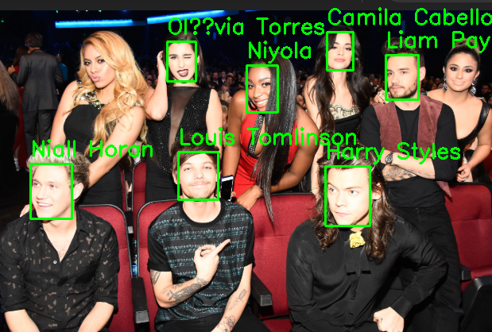
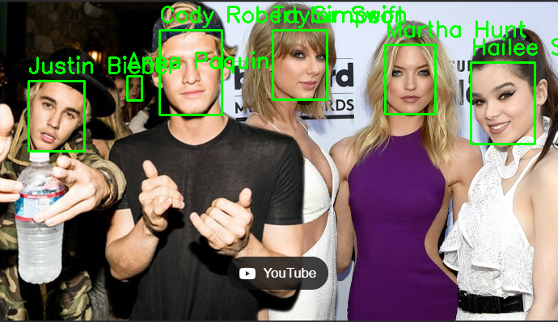

# AWS Rekognition - Detecção de Celebridades

Este projeto utiliza o AWS Rekognition para identificar celebridades em imagens. O código foi desenvolvido em Python e utiliza a biblioteca Boto3 para interagir com o serviço da AWS.

## Objetivo

O objetivo deste projeto é demonstrar como utilizar o AWS Rekognition para detectar celebridades em imagens e marcar as detecções com caixas delimitadoras e labels.

## Tecnologias Utilizadas

- **AWS Rekognition:** Serviço de análise de imagens da AWS.
- **Python:** Linguagem de programação utilizada para desenvolver o código.
- **Boto3:** Biblioteca Python para interagir com os serviços da AWS.
- **OpenCV:** Biblioteca para processamento de imagens.

## Passos para Execução

1. Configurar o AWS CLI com as credenciais corretas.
2. Instalar as dependências: `boto3` e `opencv-python`.
3. Executar o Jupyter Notebook `aws-Rekognition.ipynb`.
4. Verificar as imagens geradas com as celebridades detectadas.

## Insights

- O AWS Rekognition é uma ferramenta poderosa para detecção de objetos e faces em imagens.
- A precisão da detecção de celebridades é impressionante, mesmo em imagens com múltiplas pessoas.
- A integração com outras ferramentas de análise de dados pode ampliar as possibilidades de uso.

## Possibilidades

- Integração com sistemas de recomendação baseados em celebridades.
- Análise de sentimentos em imagens.
- Detecção de objetos em tempo real.

## Screenshots

